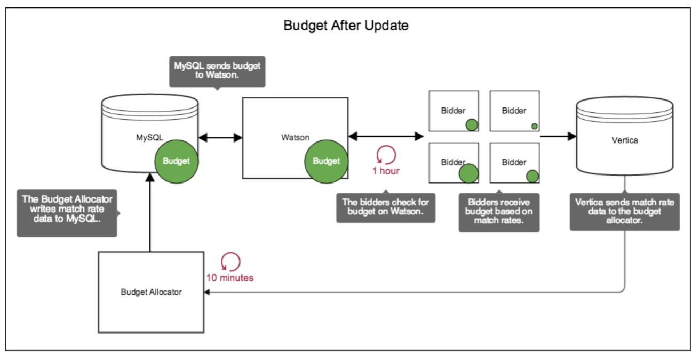

The budget allocator, MySQL, Watson, Vertica, and the bidders are important components that manage and distribute budgets. Because the budget allocator and the bidders update data on separate schedules, their independent operations affect how and when budget data is distributed. 
 
## Budget distribution before updates

In Backoffice, a MySQL database stores budget cap information for each tactic. However, budgets aren't immediately available to the bidders. Another system, the budget allocator, must run first to send bidder match rate data to Watson.

Match rates allow Watson to assign budget amounts to each bidder in proportion to how many bids they've matched, given the constraints set by a tactic. If the bidders don't have a budget, they simply send match rate data to Vertica, where it is passed on to the budget allocator. 

In the illustration, the green circle shows how budget information is distributed before the budget allocator or the bidders update themselves.

## Budget distribution after updates

Here is how budget data moves through the ad serving stack after an update.

<table>
  <thead>
    <tr>
      <th>System</th>
      <th>Description</th>
    </tr>
  </thead>
  <tbody>
    <tr>
      <td><strong>Budget allocators</strong></td>
      <td>At 10-minute intervals, the budget allocator checks Vertica for bidder match rate data. It applies a formula to this data, setting the budget for each bidder based on their performance. The budget allocator then sends match rate data to MySQL, where it is passed on to Watson.</td>
    </tr>
    <tr>
      <td><strong>Watson</strong></td>
      <td>Watson is the authoritative source of budget information for the bidders. In this system, Watson:
        <ul>
          <li>Allocates budgets to the bidders.</li>
          <li>Tracks how much they spend.</li>
          <li>Stops the bidders when they've exhausted their budget.</li>
        </ul>
        For more information about how Watson manages budgets, see LINK TO OTHER ARTICLE HERE.
      </td>
    </tr>
    <tr>
      <td><strong>Bidders</strong></td>
      <td>At 1-hour intervals, the bidders load and reload all available campaign data from Watson. This ensures they have the latest budget and campaign data, taking bidder performance into account. As a result, the bidders receive budget amounts in proportion to their match rates; bidders that match a high volume of requests receive more budget than those with fewer bid requests. Finally, the bidders continue to send match rate data to Vertica, which is passed on to the budget allocator.</td>
    </tr>
  </tbody>
</table>

In the illustration, the green circle shows how budget information is distributed after the budget allocator and the bidders update themselves.

Note that these separate update intervals can prevent a tactic from serving from 10 minutes up to an hour. For more information about this delay and how to force an update, see PLACEHOLDER LINK TO OTHER ARTICLE HERE.

## Related topics

[Budget Distribution Between and Within Data Centers](./budget-distribution.md)