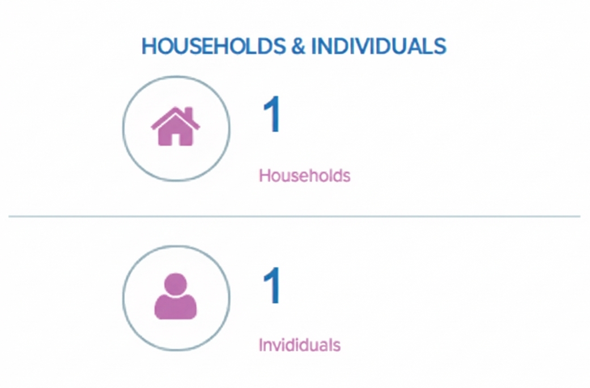
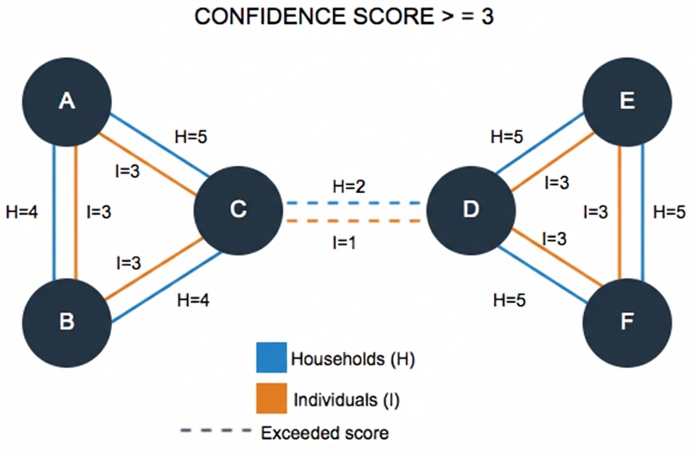
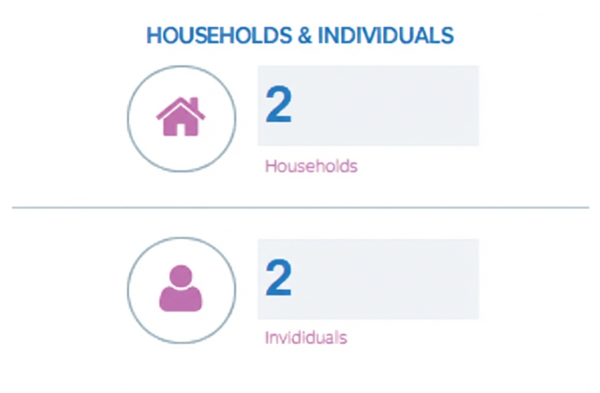
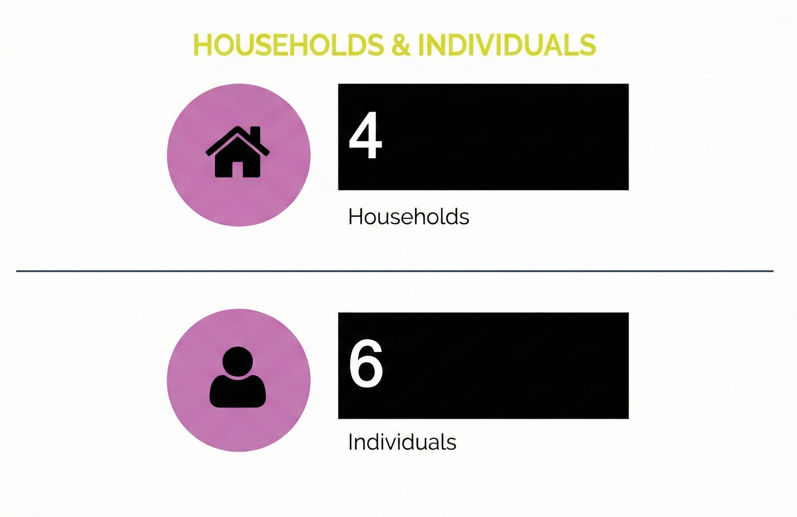

Most devices in the Device Graph share a "connection" with another device. The data linking groups of devices together is called a _connected component_. Connected component data includes a household score (H) and an individual score (I). Collectively, these values are known as _confidence scores_.

Confidence scores define the strength of the relationship between each device. When you raise or lower the value in a Confidence Score option, this action increases or decreases the results returned by that feature.

!!!note
    Remember, confidence scores and connected components are abstractions that represent different data points. They are not physical links between devices.

## How confidence scores work

To help you understand how these scores affect your results, let's take a look at a few examples using the 
Households and Individuals tile on the dashboard. The following diagrams represent connected devices in the Device Graph. In the graph, a circle represents a device and the lines between each device represent the household or individual connection between them.

### Example: Confidnece Score 1 results

In the first example, let's set the confidence score equal to or greater than 1. In the graph, all of the connected components match or exceed this value. As a result, the graph considers all 6 devices in a single "household" and "individual" group for this score and audience.

{: .screenshot}

With this confidence score, the Households and Individuals tile returns a count of 1 household and 1 individual group.

{: .screenshot width="80%" }

### Example: Confidence Score 3 results

Next, let's set the confidence score equal to or greater than 3. In the graph, the selected value is greater than the scores set on the connected component between devices C and D. The dashed line indicates the relationship between these devices is no longer valid at this confidence score. As a result, we now have 2 household and 2 individual groups for this score and audience.

{: .screenshot}

When clicked, the Households and Individuals tile returns a count of 2 households and 2 individual groups.

{: .screenshot width="80%" }

### Example: Confidence Score 5 results

As you raise the confidence score, and exceed the values set on each connected component, the number of households and/or individual groups increases. For example, let's look at what happens when the confidence score greater than or equal to 5. This value (5) is greater than most household and individual scores in the graph sample graph below. Only devices D, E, F remain connected at the household level. All other devices get counted as separate groups.

These results give us:

- **4 household groups**: A, B, C (each is a separate group), and D, E, F (counted as 1 group)
- **6 individual groups**: A, B, C, D, E, F (each is a separate group)

{: .screenshot}

When clicked, the tile returns a count of 4 households and 6 individual groups.

{: .screenshot width="80%" }
